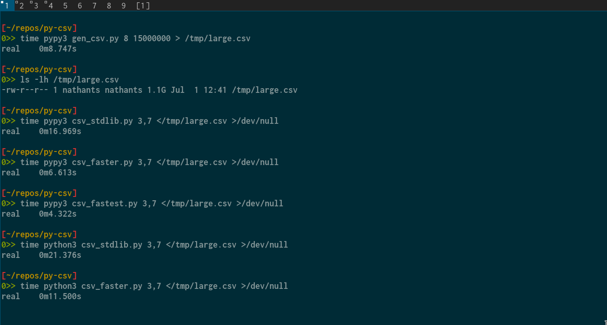

## why

it should be possible to process well formed csv in pure python with decent performance.

## what

a code template of boilerplate to copy/paste and then modify row handling code.

## how

python doesn't have inlining or macros, so far maximum performance we have to manually inline code into the body of the parsing loop.

for input we minimize allocations and syscalls by reading large chunks into a buffer and only allocating meta data about the start and end offset of each column in a row.

for output we mutate a byte buffer and only call write when the buffer would overflow.

this parsing is only for well formed csv, and is only aware of comma and newline. if you need to parse that is not well formed, use the standard library parser.

if you need to go faster than this, look into using similar techniques to minimize allocations and syscalls with [native code](https://github.com/nathants/bsv/tree/master/experiments/cut)

## demo

